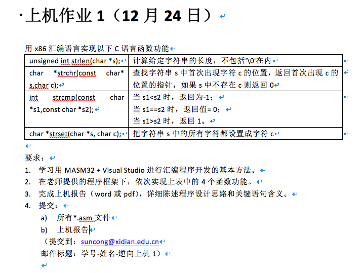

## 逆向工程上机报告一

### 要求



### 实验过程

#### strlen 

##### 实验思路

遍历字符串，从开始位置到结束符。

记录开始的时候的首地址和结束的末尾地址，两个地址相减，换算得字符串长度。

##### 实验代码

```
.386
.model flat, stdcall

include kernel32.inc
includelib kernel32.lib

include msvcrt.inc
includelib msvcrt.lib

.data
szText	db	"Reverse Engineering", 0
format	db	"length = %d", 0AH, 0

.code

main PROC  ；主循环
	LEA EDI, szText
	MOV ECX,0FFFFFFFFH

	fb:  ；遍历循环所有的字符串
	MOV AL, [EDI]
	CMP AL, 0
	JZ fe
	ADD EDI, 1
	JMP fb
	fe:
	LEA EAX, szText
	SUB EDI, EAX

	INVOKE crt_printf, addr format, EDI

	INVOKE crt_getchar
	INVOKE ExitProcess, 0
main ENDP

END main

```

##### 实验结果


#### strchr

##### 实验思路

首先遍历字符串直到①匹配到了所要搜索的字符或者②到达了字符串结束符。

第一种表明搜索成功，直接跳出循环，将返回值存储到EAX。

第二种情况表明失败，应当返回0。所以直接将EAX置0。

##### 实验代码

```
.386
.model flat, stdcall

include kernel32.inc
includelib kernel32.lib

include msvcrt.inc
includelib msvcrt.lib

.data
szText	db	"Reverse Engineering", 0
chr		db	'i'
format	db	"%d", 0AH, 0

.code

main PROC
	LEA EDI, szText
	XOR EBX, EBX
	LEA ECX, chr
	MOV BL, BYTE PTR [ECX]

	PUSH EBX
	PUSH EDI
	CALL strchr

	CMP EAX, 0 ； 跳出循环，并存储到EAX中
	JZ SHOW
	LEA EDI, szText
	SUB EAX, EDI
	INC EAX
	
	show:
	INVOKE crt_printf, addr format, EAX
	INVOKE crt_getchar
	INVOKE ExitProcess, 0
main ENDP

strchr PROC var1:DWORD, var2:DWORD
	MOV EDI, var1
	MOV EBX, var2
	
	fb:
	MOV AL, [EDI]
	CMP AL, 0
	JNZ next
	MOV EDI, 0
	JMP fe
	
	next:
	CMP AL, BL
	JZ fe
	INC EDI
	JMP fb
	
	fe:
	MOV EAX, EDI
	ret
strchr ENDP

END main
```

##### 实验结果


#### strcmp

##### 实验思路

同时遍历两个字符串，比较两者每一个对应下标位置的字符。

如果两字符相等并且为字符串结束符，说明二者相等，返回0。

如果相等但是不为零，则继续进行比较。

如果不相等，使用CMP指令和JA指令即可判断相对大小，根据情况返回1或者-1。


##### 实验代码

```
.386
.model flat, stdcall

include kernel32.inc
includelib kernel32.lib

include msvcrt.inc
includelib msvcrt.lib

.data
format		db	"%d", 0AH, 0
szText		db	"Reverse Engineering", 0
szText2		db	"Reverse Engineering", 0	;szText==szText2
szText3		db	"Reverse Eng", 0			;szText>szText3
szText4		db	"Reverse Engj", 0			;szText<szText4
szText5		db	"Reverse Engh", 0			;szText>szText5

.code

main PROC
	LEA ESI, szText
	LEA EDI, szText2	;result=0
	;LEA EDI, szText3	;result=1
	;LEA EDI, szText4	;result=-1
	;LEA EDI, szText5	;result=1

	PUSH EDI
	PUSH ESI
	CALL strcmp

	INVOKE crt_printf, addr format, EAX

	INVOKE crt_getchar
	INVOKE ExitProcess, 0
main ENDP

strcmp PROC var1:DWORD, var2:DWORD
	MOV EDI, var1
	MOV ESI, var2

	fb:
	MOV AL, [EDI]
	MOV BL, [ESI]
	CMP AL, BL ； 比较两个字符
	JNZ next
	CMP AL, 0
	JZ none
	INC EDI
	INC ESI
	JMP fb
	
	next:
	CMP AL, BL ； 比较两个字符，并分别处理不同情况
	JA big
	MOV EAX, -1
	JMP fe

	big:
	MOV EAX, 1
	JMP fe

	none:
	MOV EAX, 0
	
	fe:
	ret

strcmp ENDP

END main
```

##### 实验结果


#### strset

##### 实验思路

遍历字符串直到遇到字符结束符。

每一次遍历将原字符串对应的位置设置为给定的字符。

使用指针依次处理所有的字符

##### 实验代码

```
.386
.model flat, stdcall

include kernel32.inc
includelib kernel32.lib

include msvcrt.inc
includelib msvcrt.lib

.data
szText	db	"Reverse Engineering", 0
chr		db	'j'

.code

main PROC
	LEA EDI, szText
	LEA EBX, chr
	MOV EBX, [EBX]

	PUSH EBX
	PUSH EDI
	CALL strset

	INVOKE crt_puts, addr szText

	INVOKE crt_getchar
	INVOKE ExitProcess, 0
main ENDP

strset PROC var1:DWORD, var2:DWORD
	MOV EDI, var1
	MOV EBX, var2

	fb:
	MOV AL, [EDI]
	CMP AL, 0
	JZ fe
	MOV BYTE PTR [EDI], BL
	INC EDI
	JMP fb

	fe:
	MOV EAX, var1
	ret

strset ENDP

END main
```

##### 实验结果


### 实验总结

通过利用汇编语言，对C语言的相关函数，进行手动实现，让我对汇编语言的实际使用有了更深入的认识，也让我对于C语言和汇编语言的联合使用也有了更多的认识，让我对于逆向工程也有了更多的认识。